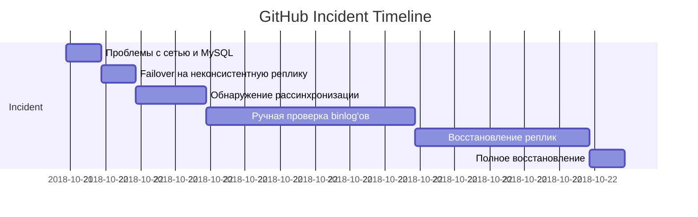

# 📄 Postmortem: Сбой в работе GitHub (21 октября 2018 года)

## 🕒 Дата и время

- **Начало:** 21 октября 2018 года, 22:52 UTC
- **Окончание:** 22 октября 2018 года, 13:15 UTC
- **Продолжительность:** ~24 часа частичной деградации

---

## ⚠️ Описание инцидента

В течение почти суток GitHub испытывал серьёзные проблемы с доступностью и консистентностью данных.  
**Проблемы для пользователей:**
- Некорректное отображение данных репозиториев
- Ошибки при создании issues и pull requests
- Проблемы с CI/CD
- Частичная недоступность ряда функций

---

## ⏰ Хронология событий

---

🔍 Причины инцидента  
Основная причина
* Ошибка в процессе управления failover MySQL-репликации, вызванная сбоем сетевой инфраструктуры.
Сопутствующие факторы
* Недостаточный контроль консистентности реплик перед переключением.
* Автоматизация failover не предусматривала проверки полноты синхронизации.
* Отсутствие достаточной изоляции сетевых сегментов при технических работах.

---

⚡ Влияние на пользователей  
* Нарушена консистентность отображаемых данных (устаревшие репозитории, issues).
* Ошибки при записи новых данных (pull requests, комментарии).
* Частичная деградация API и пользовательского интерфейса.
* Прерывание работы интеграций и CI/CD процессов.

---

✅ Принятые меры во время инцидента  
* Отключение write-операций и переход в режим деградации.
* Временное ограничение функционала для защиты целостности данных.
* Ручное восстановление актуальных данных из binlog’ов.
* Регулярные обновления статуса на status.github.com.

---

🔧 Что сделано для предотвращения повторения  
Технические меры
* Внедрение строгих проверок консистентности данных перед переключением.
* Усиление мониторинга сетевых сегментов между дата-центрами.
* Доработка логики автоматизированного failover MySQL.

Организационные меры
* Расширение инструкций и обучение команд по управлению репликацией.
* Пересмотр процедур плановых технических работ.
* Регулярное тестирование сценариев переключения с имитацией сбоев (failover drills).

---

💬 Выводы и уроки
* Автоматизация должна учитывать как доступность, так и актуальность данных.
* Failover-процессы требуют строгой логики и дополнительных валидаций.
* Прозрачная и быстрая коммуникация с пользователями — ключевой фактор поддержания доверия.
